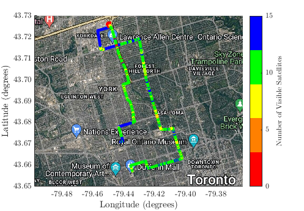
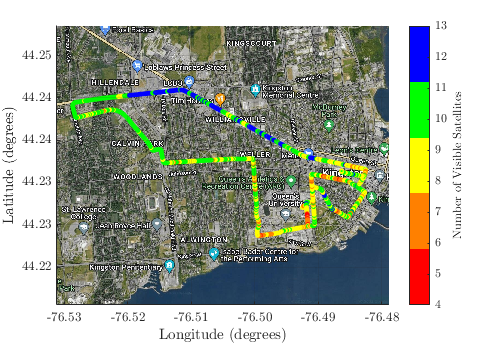
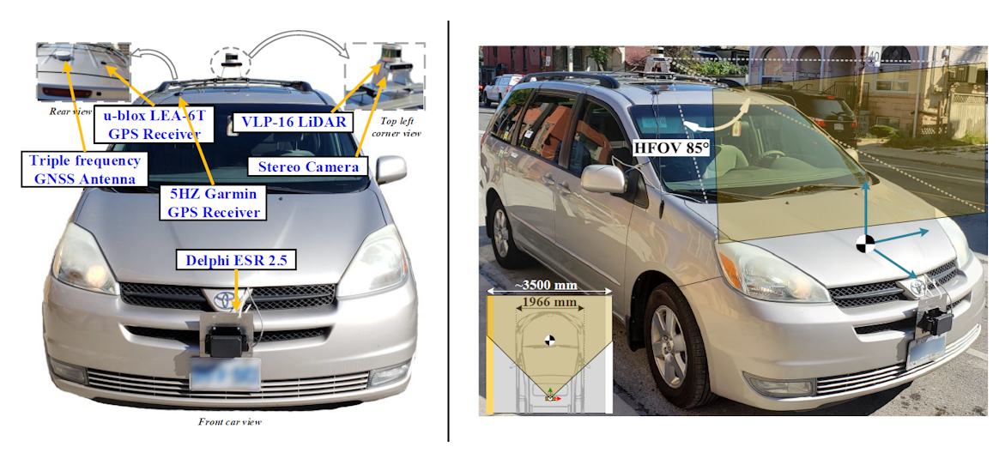

# NavINST'19 Dataset

This repository supports several publications based on my Ph.D. thesis:  
**"Integration of Topological Maps with GNSS and Onboard Sensors for Robust Land Vehicle Navigation"**  
(Queen’s University, Kingston, Ontario, Canada, July 2024).  

The thesis is currently restricted and will be made publicly accessible once the pending publications are finalized. In the meantime, it can be accessed upon request via [QSpace](https://hdl.handle.net/1974/33163).

The publications currently supported are:  
1. **"Automotive Speed Estimation: Sensor Types and Error Characteristics from OBD-II to ADAS"**  
   (conference paper, a preprint available on [arXiv](https://arxiv.org/abs/2501.00242)).  
2. **"Waypoint-Informed Localization (WiL): A Novel Integration of 2D Maps and Onboard Sensors for Robust GNSS-Denied Navigation"**  
   (journal paper, to be submitted in February 2025).  

<!-- ---

<h1 style="font-size: 1.25em;">Automotive Speed Estimation: Sensor Types and Error Characteristics from OBD-II to ADAS</h1>

This repository accompanies the IEEE conference paper **"Automotive Speed Estimation: Sensor Types and Error Characteristics from OBD-II to ADAS"**. A preprint is available on [arXiv](https://arxiv.org/abs/2501.00242). -->

---

## Overview

This repository provides supplementary material for the papers, including images, code, and datasets demonstrating the results discussed in the publications. Below are the visualizations of the road test trajectories referenced in the papers, located in the `/imgs` folder.

<div align="center">

---

**Table:** Statistics of the conducted road test trajectories.
| **Label** | **Trajectory name**   | **Duration**       | **Avg. speed**  |
|-----------|------------------------|--------------------|-----------------|
| K19.1     | Kingston 21-08-2019   | 41 mins 43 sec     | 18.133 km/h     |
| T19.1     | Toronto 13-10-2019    | 1 hr 00 min        | 14.0228 km/h    |
| T19.2     | Toronto 13-10-2019    | 1 hr 10 mins       | 19.938 km/h     |

### <ins>Section 1: Road Test Trajectory Visualizations</ins>

### Figure 1: Toronto T19.1

### Figure 2: Toronto T19.2

### Figure 3: Kingston K19.1

### <ins>Section 2: Error Analysis</ins>


*Error variance analysis on OBD-II-derived vehicular speed data gathered throughout the 3 different trajectories.*

### <ins>Section 3: Field Test Setup</ins>
  
  


<p align="center">
  *Snapshots of the vehicle testbed equipped with sensors, along with the OBD-II to UART interfacing module, all utilized for data collection and validation.*
</p>

</div>
---

## Citation

If you find this work useful, please cite the corresponding publication:

```
@phdthesis{ragab_integration_2024,
	address = {Kingston, Ontario, Canada},
	title = {Integration of {Topological} {Maps} with {GNSS} and {Onboard} {Sensors} for {Robust} {Land} {Vehicle} {Navigation}},
	copyright = {CC BY 4.0},
	language = {eng},
	school = {Queen's University},
	author = {Ragab, Hany},
	month = July,
	year = {2024},
}
```
```
@inproceedings{ragab_automotive_2025,
  title={Automotive Speed Estimation: Sensor Types and Error Characteristics from OBD-II to ADAS},
  author={Ragab, Hany, Givigi, Sidney and Noureldin, Aboelmagd},
  doi = {10.48550/arXiv.2501.00242},
  year={2025},
  note={Preprint available at https://arxiv.org/abs/2501.00242},
}
```

Thank you :)

## Acknowledgments

1. We would like to express our sincere gratitude to Dr. M. Karaim for generously providing his minivan for the road test experiments.  
2. Special thanks to Mr. M. Adam for his invaluable assistance in building the mounts used in the experiments.  
3. Data collection was carried out collaboratively by Dr. M. Karaim, Ms. S. K. Abdelaziz, Mr. M. Rashed, Mr. A. Aboutaleb, and Dr. H. Ragab. [View team photo](https://photos.app.goo.gl/VjGzmWq3mvUCKFh67).

This research activity was funded by the Natural Sciences and Engineering Research Council of Canada (NSERC) through a Discovery Grant, with additional support from DND and Mitacs through the Mitacs Accelerate program (IT number: IT12699), all under the supervision of Dr. A. Noureldin.

---

## License

This project is licensed under the MIT License. See the `LICENSE` file for details.

---
